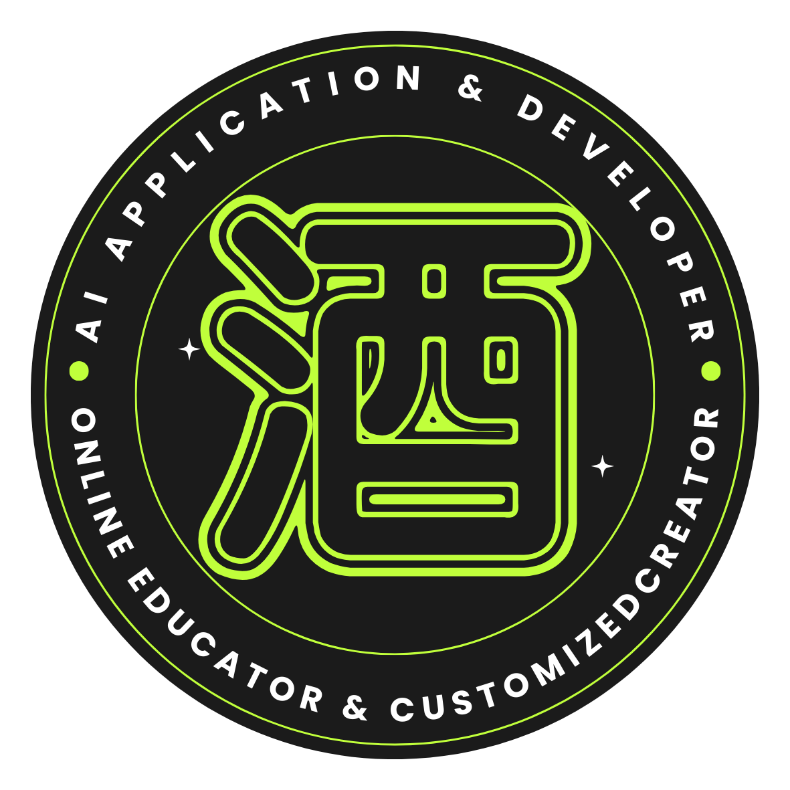

<p align="center">
  
</p>

<h1 align="center">品牌內容引擎 Brand Content Engine</h1>

<p align="center">
  by <b>酒Ann</b> · AI Application &amp; Developer / Online Educator &amp; Customized Creator
</p>

<p align="center">
  <b>繁體中文</b> · <a href="README.en.md">English</a>
</p>

一個**單檔 HTML** 的品牌內容生產工具。下載一個檔案、用瀏覽器打開，就能跑完整條流程：爬自己的網站 → 解析品牌定位 → 分析競品 → 產出內容。

沒有後端、沒有安裝、沒有帳號、沒有 JavaScript 依賴套件。

## 快速開始

1. 下載 `brand-content-engine-pro.html`
2. 用瀏覽器打開（雙擊即可）
3. 在「00 模型與金鑰」選一家供應商、貼上 API 金鑰
4. 按「測試連線」確認通了，然後往下一步一步跑

還沒有任何 API 金鑰？看 [零成本起步：申請 Groq 金鑰](#零成本起步申請-groq-金鑰)，不用綁信用卡，一分鐘就能跑第一次。

## 先看成果再決定要不要用

還沒有 API 金鑰也可以先看：在「00 模型與金鑰」按**「看範例結果」**，會載入一份跑完的虛構品牌案例，十個步驟的產出全部填好，**不會發出任何請求**。想從自己的品牌開始，按「清空進度」即可。

## 進度不會丟

- **自動保存**：每一段完成就寫進瀏覽器，關掉分頁再打開會自動還原並顯示存檔時間
- **離開前提醒**：有未存檔的變動時，關閉分頁會跳確認
- **匯出／匯入 JSON**：可以備份、換電腦、交接給同事，匯入後直接接著跑
- **存成檔案**（Chrome、Edge）：指定一個本機檔案，之後每次更新都自動寫入。**把它放在 Google Drive、iCloud 或 Dropbox 的同步資料夾，就等於雲端備份**，而且不需要授權任何帳號，也沒有經過任何伺服器

金鑰**不會**被寫進進度存檔，它有自己的儲存與開關。

## 隱私

金鑰只存在你自己的瀏覽器 `localStorage`，並且**直接送到模型供應商，不經過任何中介伺服器**，因為這個專案根本沒有伺服器。

不想留存的話，不要勾「在這台電腦記住金鑰」，金鑰就只活在當前分頁。

## 字體

中文使用**思源黑體（Noto Sans TC）**，從 Google Fonts 載入。這是整個檔案唯一的外部資源，而且是選用性質：

- **有網路時**：所有人看到的都是思源黑體，顯示一致
- **離線、內網、或連不到 Google 時**：字體請求會靜默失敗，自動落回你電腦上的系統字體（macOS 是 PingFang TC，Windows 是微軟正黑體），**功能完全不受影響**

換句話說，把 HTML 下載到本機離線跑，工具照樣能用，只是中文會用你自己電腦的字體來顯示。API 金鑰與任何內容都不會經過這個字體請求。

不想要這個外部請求的話，把 HTML 開頭那三行 `<link>` 刪掉就好，其餘完全不受影響。

## 介面語言與產出語言

兩個獨立的控制項：

- **介面語言**：預設由瀏覽器語系判定，中文系語系顯示中文，其餘顯示英文。右上角的 中 / EN 可以手動切換，一旦按過就以你的選擇為準，並記在這個瀏覽器裡。
- **產出語言**：00 段的下拉選單，決定模型用什麼語言寫，預設同樣跟著瀏覽器語系。兩者完全獨立，可以介面看英文、產出繁中，或反過來。

## 支援的語言模型

目前支援 9 家供應商：

| 供應商 | 建議模型 | 金鑰申請 | 適合誰 |
|---|---|---|---|
| **Anthropic Claude** | `claude-sonnet-5`、`claude-opus-5`、`claude-haiku-4-5-20251001` | console.anthropic.com | 長文脈絡與結構化輸出穩定 |
| **OpenAI** | 不適用 | 不適用 | **無法使用**，見下方 CORS 說明 |
| **Google Gemini** | `gemini-2.0-flash`、`gemini-2.5-flash`、`gemini-2.5-pro` | aistudio.google.com | 有免費額度 |
| **DeepSeek** | `deepseek-chat`、`deepseek-reasoner` | platform.deepseek.com | 單價便宜 |
| **Kimi（Moonshot）** | `moonshot-v1-32k`、`moonshot-v1-128k`、`kimi-latest` | platform.moonshot.cn | 長文處理 |
| **智譜 GLM** | `glm-4-plus`、`glm-4-flash`、`glm-4-air` | open.bigmodel.cn | 中國方案 |
| **MiniMax** | `MiniMax-Text-01`、`abab6.5s-chat` | platform.minimax.chat | 中國方案 |
| **Groq** | `llama-3.3-70b-versatile`、`llama-3.1-8b-instant`、`qwen-2.5-32b` | console.groq.com | 速度極快、有免費額度 |
| **Ollama** | `llama3.2`、`qwen2.5:7b`、`gemma3` | 不需要金鑰 | 零 API 費用，跑在本機 |

### 關於 CORS

這是純前端工具，瀏覽器直連 API 需要供應商放行跨來源請求。以下是 2026 年 8 月 3 日從正式站實測的結果（用無效金鑰發請求，能讀到 401 就代表 CORS 有放行）：

| 供應商 | 瀏覽器直連 |
|---|---|
| Anthropic Claude | 可用 |
| Google Gemini | 可用 |
| DeepSeek | 可用 |
| Kimi（Moonshot） | 可用 |
| 智譜 GLM | 可用 |
| MiniMax | 可用 |
| Groq | 可用 |
| Ollama | 可用，需先設 `OLLAMA_ORIGINS` |
| **OpenAI** | **不可用** |

**OpenAI 為什麼不能用**：帶 `authorization` 標頭的請求會先送出 CORS 預檢，而 OpenAI 不回應這個預檢，瀏覽器就直接擋下。這是他們刻意的政策，用意是避免有人把金鑰放進前端。不帶授權標頭的請求反而能通，這也印證了是預檢被拒，不是網路問題。

**沒有辦法在純前端繞過**，除非自己架一台代理伺服器，而那正好違背這個專案不要後端的前提。所以工具裡 OpenAI 那一項會直接標示不可用並停用測試按鈕，不會讓你白貼金鑰。

### 零成本起步：申請 Groq 金鑰

Groq 有免費方案，申請不用綁信用卡，大約一分鐘：

1. 到 `console.groq.com`，用 Google 或 GitHub 帳號登入
2. 左側選單進入 **API Keys**
3. 按 **Create API Key**，取個名字（例如 `brand-content-engine`）
4. **金鑰只會完整顯示這一次**，當場複製起來
5. 回到工具，供應商選 Groq，把金鑰貼進「API 金鑰」欄位，按「測試連線」

免費方案的速率限制：

| 模型 | 每分鐘請求 | 每分鐘 token |
|---|---|---|
| `llama-3.3-70b-versatile` | 30 | 12,000 |
| `llama-3.1-8b-instant` | 30 | 6,000 |

**先知道這件事會少走冤枉路**：本工具在解析網站時最多會送出 18,000 字語料，中文的 token 數大致與字數同量級，很容易超過免費方案每分鐘 12,000 token 的上限。網站內容較長時，Groq 免費方案會回報 rate limit。三個解法：

1. 改用「手動貼上」，只貼首頁與關於我們的重點段落
2. 等一分鐘再重試
3. 前面幾段用其他供應商跑，貼文與文案階段再切回 Groq

### 使用 Ollama

先讓本機服務允許瀏覽器連線，否則會被 CORS 擋：

```bash
OLLAMA_ORIGINS=* ollama serve
```

然後拉一個模型：

```bash
ollama pull llama3.2
```

## 新增供應商

供應商都集中在 `PROVIDERS` 這張表裡。大部分服務都相容 OpenAI 的 `/chat/completions` 格式，這種只要加四行就好，不用動 `callLLM`：

```js
newprovider: {
  label:'顯示名稱', kind:'openai',
  url:'https://api.example.com/v1/chat/completions',
  models:['model-a','model-b'],
  note:'給使用者看的一行說明。'
}
```

`kind` 只有三種：`openai`（相容格式，多數）、`anthropic`（Messages API）、`gemini`（generateContent）。不需要金鑰的服務加上 `needsKey:false`。

## 授權

**這不是 open source，是 source-available。** 原始碼公開、可自由閱讀修改，但有一項限制。

- [LICENSE](LICENSE)：Functional Source License 1.1（MIT Future License）
- [ADDITIONAL-GRANT.md](ADDITIONAL-GRANT.md)：著作權人發布的額外授權，**放寬**教學用途的限制

三句話版本：

| | |
|---|---|
| ✅ **可以** | 自己用、公司內部用、改它、發布你的修改版、**拿去上收費課程或企業內訓** |
| ❌ **不可以** | 把它（含改名換皮的版本）當產品賣、架成 SaaS 收費、做出功能實質相同的競品 |
| ⏳ **兩年後** | 每個版本在釋出滿兩年後自動轉為 MIT 授權，限制全部解除 |

判斷原則：**教學可以收費，軟體本身不可以。**

需要落在禁止範圍內的使用方式，歡迎洽談商用授權。

## 聯絡

**酒Ann**　cpw688@gmail.com

AI 應用開發 / 線上教學 / 客製化開發
